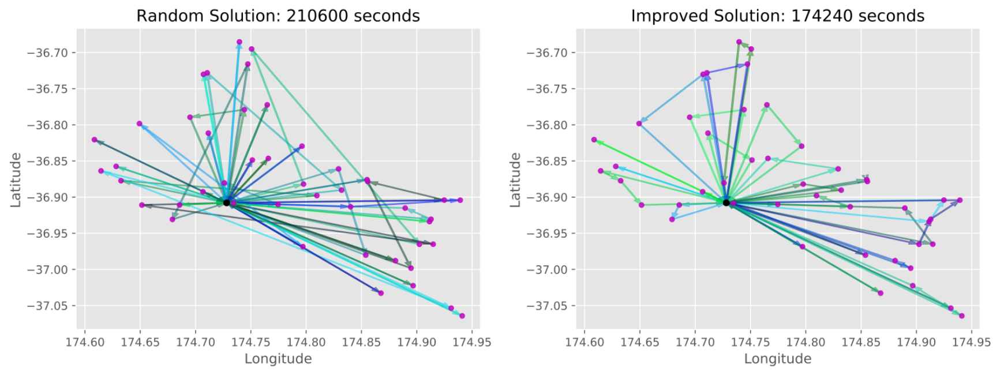

# Vehicle Route Optmisation with Simulated Annealing
Created by Dominic Keehan [Majority of development in October 2019, written in Python]

This repository contains an implemenation of, and visualisation tools for, solving the Vehicle Routeing Problem; a classic in operations research. This is through applying a self constructed simulated annealing algorithm, based on self driven research. It deals with finding the best way to have a fleet of trucks deliver goods to a range of supermarkets, around the wider Auckland area. Geographical data is exported from the 'OpenStreetMaps' API. This was inspired by an assignment faced in a university course which required me to solve the same problem combinatorics problem with many, simpler heuristics (two-opt swap, prim and kruskal's algorithms). Interest in this project was driven by a want to see how much a modern metaheuristic could improve the found routes. 

https://en.wikipedia.org/wiki/Simulated_annealing

https://en.wikipedia.org/wiki/Vehicle_routing_problem

This solver and plotter requires csv files containing; The coordinates of each delivery location, the travel time from each location to each other location, and the amount each ocation needs delivered. Example files included are 'FoodstuffLocations.csv', 'FoodstuffTravelTimes.csv' and 'OurDemand.csv' respectively.

Here is an example of its application to the csv files included in this repository, obtained by running the VRPSimulatedAnnealing file:

It is worth noting the improved solution shows a distinct petalling pattern around the origin of each vehicle, indicative of a realistic solution.

Goals:

Develop an understanding of the intricacies of simulated annealing

Future work:

Investigate how the temperature cooling schedule can be improved (perhaps by dynamic updates), currently termination is only acheived by reaching max iterations.
